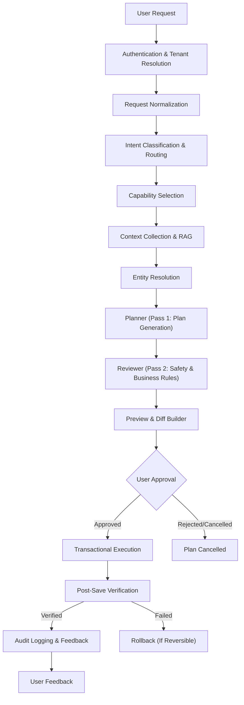

# AI Agent V2 System Documentation

Welcome to the official documentation for the **AI Agent V2** system of the E-Commerce SaaS Platform (Shop Builder). This system has been redesigned from the ground up to provide a highly secure, transactional, auditable, and robust AI execution framework.

---

## 1. Architectural Overview

The AI Agent V2 system operates on a strict **"propose-validate-approve-execute-verify-audit"** lifecycle. The AI model never directly mutates the database; instead, it proposes a structured, typed execution plan (ChangeSet) which is validated by the server, reviewed for safety, approved by the user, executed in a database transaction, verified post-save, and recorded in the audit log.



---

## 2. Database Models & Schema

The database schema has been extended with additive models to support the complete lifecycle of the AI Agent V2.

### `AiChangeSet`
Represents a proposed set of changes generated by the AI Agent.
* `id` (String, @id, default CUID)
* `shopId` (String, indexed)
* `prompt` (String) - The original user prompt
* `status` (String, default "pending") - `pending`, `approved`, `executed`, `failed`, `cancelled`, `rolled_back`
* `riskLevel` (String) - `low`, `medium`, `high`
* `riskAnalysis` (String?)
* `summary` (String?) - Persian summary of proposed changes
* `steps` (`AiChangeStep[]`)
* `approvals` (`AiApproval[]`)
* `feedbacks` (`AiFeedback[]`)
* `createdAt` / `updatedAt`

### `AiChangeStep`
Represents a single database operation within a ChangeSet.
* `id` (String, @id, default CUID)
* `changeSetId` (String, indexed)
* `action` (String) - `create`, `update`, `delete`
* `modelName` (String) - `Product`, `Category`
* `recordId` (String?) - The ID of the record being modified or deleted
* `beforeValue` (Json?) - The state of the record before execution (used for rollback)
* `afterValue` (Json?) - The state of the record after execution
* `order` (Int, default 0) - Execution order

### `AiApproval`
Records the user approval or rejection of a ChangeSet.
* `id` (String, @id, default CUID)
* `changeSetId` (String, indexed)
* `userId` (String)
* `approved` (Boolean)
* `notes` (String?)

### `AiFeedback`
Allows merchants to submit qualitative feedback on the quality of the AI-generated plan.
* `id` (String, @id, default CUID)
* `changeSetId` (String, indexed)
* `rating` (Int) - 1 to 5 stars
* `comments` (String?)

---

## 3. Core Subsystems

### 3.1. Intent Router (`src/lib/ai-agent-v2/intent-router.ts`)
A two-layered routing mechanism:
1. **Layer 1 (Deterministic)**: Fast, free, and 100% reliable regex pattern matching on key Persian terms (e.g., `قیمت`, `دسته`, `سفارش`).
2. **Layer 2 (AI Routing)**: Falls back to the `router` model slot to classify complex prompts.

### 3.2. Entity Resolver (`src/lib/ai-agent-v2/entity-resolver.ts`)
Handles deterministic and fuzzy resolution of products, categories, and orders.
* **Persian Text Normalization**: Standardizes Arabic characters, removes diacritics, and normalizes spaces.
* **Fuzzy Matcher**: Compares normalized search terms against in-memory records to find the best match with a calculated confidence score.

### 3.3. Context Builder (`src/lib/ai-agent-v2/context-builder.ts`)
Builds a tenant-scoped, minimal context for the AI planner. It fetches:
* Shop settings (currency, language, theme)
* Relevant products (using fuzzy matching or RAG)
* Shop categories
* Recent orders (if relevant to the prompt)

### 3.4. Planner & safety Reviewer (`src/lib/ai-agent-v2/planner.ts` & `plan-reviewer.ts`)
* **Pass 1 (Planner)**: Generates a structured JSON plan matching `ChangeSetSchema` using the `complex` model slot.
* **Pass 2 (Reviewer)**: An independent safety check using the `simple` model slot to verify business rules (e.g., positive prices, valid discount percentages) and correct minor issues.

### 3.5. Executor & Verifier (`src/lib/ai-agent-v2/executor.ts` & `verifier.ts`)
* **Transactional Execution**: Applies all steps of an approved ChangeSet inside a single PostgreSQL database transaction (`prisma.$transaction`).
* **State Capturing**: Automatically fetches and records the `beforeValue` of any modified or deleted records to ensure auditability and rollback capability.
* **Post-Save Verification**: Verifies that the database state matches the expected `afterValue` after execution.

### 3.6. Rollback Engine (`src/lib/ai-agent-v2/rollback.ts`)
Reverts a completed ChangeSet by applying the stored `beforeValue` data in reverse order inside a database transaction, restoring the records to their exact original state.

---

## 4. API Contract Reference

### `POST /api/admin/ai-agent/plan`
Generates and reviews a proposed ChangeSet for a user prompt.
* **Request**: `{ "prompt": "قیمت آیفون ۱۳ را به ۴۲ میلیون تغییر بده" }`
* **Response**:
```json
{
  "success": true,
  "explanation": "طرح تغییرات با موفقیت تولید شد.",
  "changeSetId": "changeset_abc123",
  "tasks": [
    {
      "id": "task_abc123_0",
      "target": "products",
      "action": "update_product",
      "improvedPrompt": "عملیات ویرایش روی محصول",
      "idempotencyKey": "hash_val",
      "saveEndpoint": "/api/admin/products/prod_1",
      "payload": { "price": 42000000 }
    }
  ]
}
```

### `POST /api/admin/ai-agent/changes/[id]/execute`
Executes and verifies an approved ChangeSet.
* **Request**: `{}`
* **Response**: `{ "success": true, "message": "طرح تغییرات با موفقیت اجرا و تایید شد." }`

### `POST /api/admin/ai-agent/changes/[id]/rollback`
Rolls back an executed ChangeSet.
* **Request**: `{ "notes": "اشتباه سهوی ادمین" }`
* **Response**: `{ "success": true, "message": "طرح تغییرات با موفقیت بازگردانی شد." }`

---

## 5. Security & Reliability Principles

1. **Fail-Closed Quota Checking**: If the database or Redis is down, quota checking fails closed for tenant-billable requests to prevent free API abuse.
2. **Platform Billing Mode**: System-owned operations (like routing or safety review) use `billingMode: "platform"` to bypass quota safely.
3. **No Hardcoded Backdoors**: Removed all hardcoded credentials and backdoors. Enforced strict environment variables in production.
4. **Secure Cookies**: Applied `httpOnly`, `secure` (in production), `sameSite: "lax"`, and proper `maxAge` to all authentication cookies.
