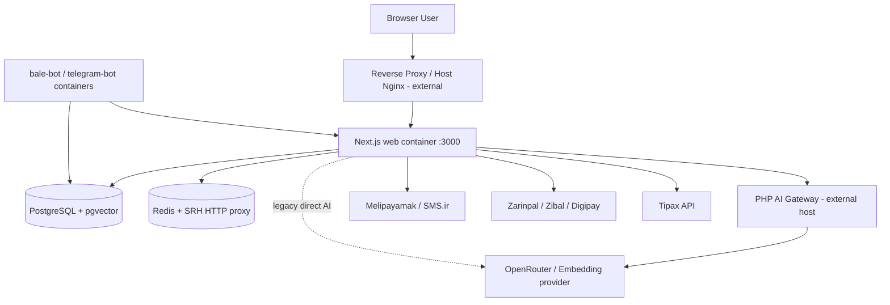
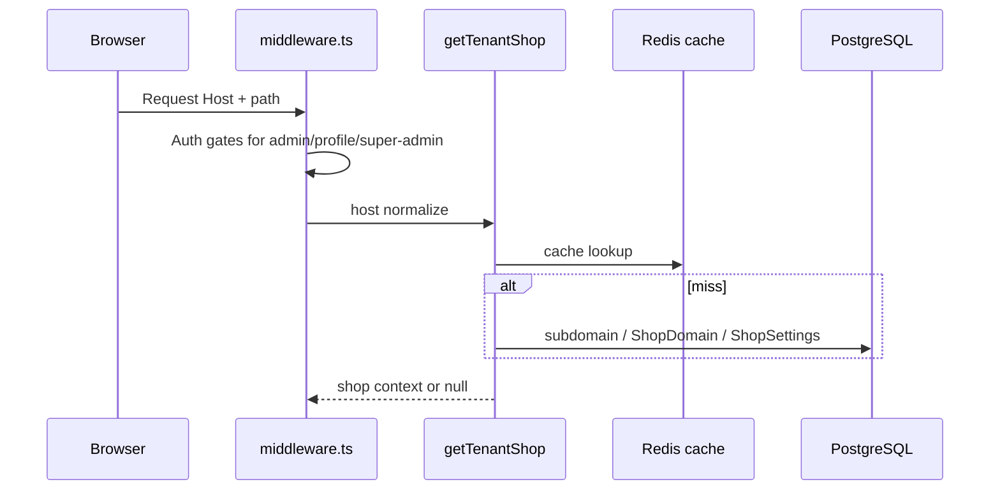
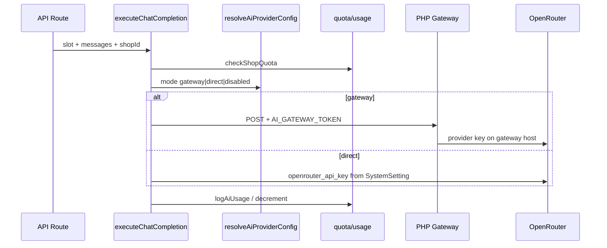
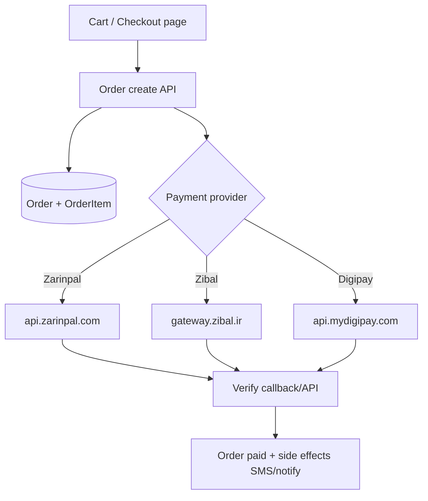
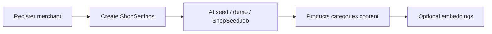
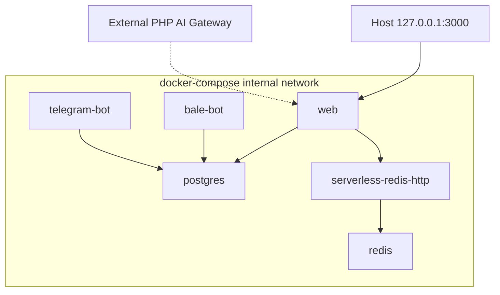

# 02 — معماری سیستم

## هدف کسب‌وکار
فروشگاه‌ساز متمرکز: هر تاجر یک فروشگاه (tenant) روی همان هسته؛ شخصی‌سازی از DB/CSS variables؛ پکیج/سهمیه AI؛ دامنه اختصاصی؛ کانال‌های پیام و پرداخت ایرانی.

## اجزای سطح بالا



Evidence: `docker-compose.yml`؛ `deploy/ai-gateway/index.php`؛ `src/lib/ai-provider/config.ts`

## Runtime boundaries
- **Server:** App Router RSC، API routes، Prisma، Redis، Sharp، queue فایل‌محور
- **Client:** کامپوننت‌های `use client`، Zustand stores
- **Deployment-only:** Docker، PHP gateway، bot scripts

## Tenant resolution lifecycle



Evidence: `src/lib/tenant.ts`؛ `src/middleware.ts`

## Authentication overview

```mermaid
flowchart LR
  SA[super_admin_token] --> SAP[/super-admin]
  AD[admin_token] --> ADM[/admin + /api/admin]
  CU[customer_token] --> PR[/profile /checkout]
  JWT[jose jwtVerify + JWT_SECRET]
  SA --> JWT
  AD --> JWT
  CU --> JWT
```

Evidence: `src/middleware.ts:40-184`؛ `src/lib/auth.ts:9-88`

## AI request flow (canonical)



Evidence: `src/lib/ai-provider/client.ts`؛ `config.ts:32-57`

## Checkout / payment (منطقی)



Evidence: hardcoded URLs در `_raw-external-urls.txt`؛ libs `digipay.ts`؛ جستجوی zarinpal/zibal در src

## Store onboarding



Evidence: مدل‌های `ShopSeedProfile`, `ShopSeedJob`؛ `src/lib/ai/store-seed/*`

## Deployment topology



Evidence: `docker-compose.yml:1-118`

## Upload / media flow

```mermaid
flowchart LR
  Admin[Admin media UI] --> UploadAPI[Upload API]
  UploadAPI --> Disk[public/uploads volume]
  UploadAPI --> Sharp[sharp processing]
  UploadAPI --> Poof[Poof BG remove optional]
  Disk --> Public[/uploads served]
```

Evidence: `docker-compose.yml:76-77` volume `uploads_data`؛ `sharp` در package.json؛ `poof_api_key`

## Error / logging
- Perf/cache logs با `ENABLE_PERF_LOGS` / `ENABLE_CACHE_LOGS`
- AI usage در `AiUsage`
- verifyAuth دارای console.logهای تشخیصی

Evidence: env names؛ `auth.ts:31`؛ `ai-provider/usage.ts`
